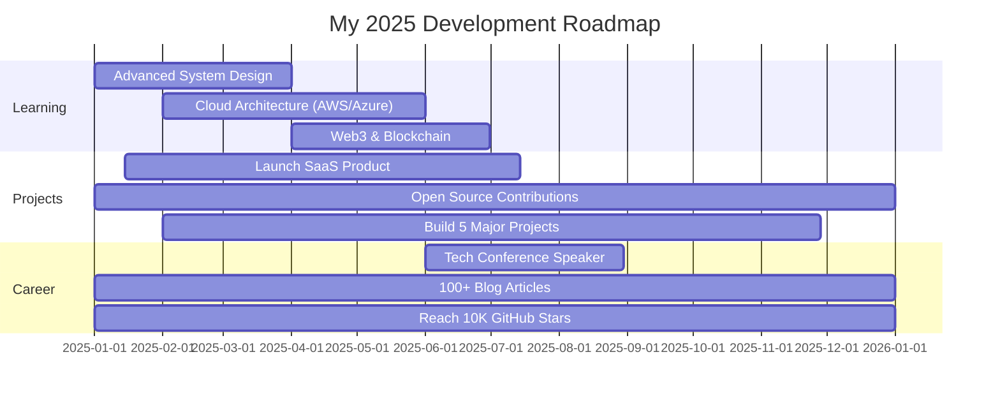
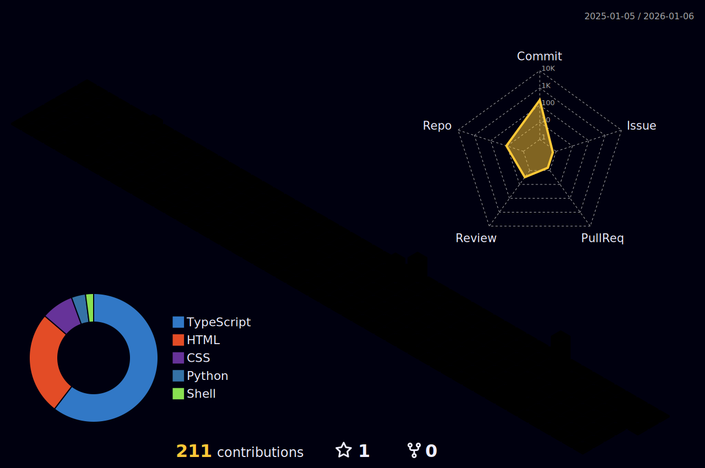

<!-- Animated Hero Section -->
<div align="center">

<!-- Dynamic Typing Animation -->


<!-- Animated Wave -->


</div>

<!-- Profile Section with Enhanced Stats -->
<div align="center">


<p align="center">
  <a href="https://git.io/typing-svg"></a>
</p>

<!-- Animated Badges -->
<p align="center">
  
  
  
  
  
</p>

<!-- Social Media Interactive Buttons -->
<p align="center">
  <a href="https://linkedin.com/in/arghyadip-pakhira" target="_blank">
    
  </a>
  <a href="https://twitter.com/arghya_dip7" target="_blank">
    
  </a>
  <a href="mailto:arghyadip.info@gmail.com">
    
  </a>
  <a href="https://arghyadevs.me" target="_blank">
    
  </a>
</p>

</div>

<!-- Enhanced Stats Grid -->
<div align="center">

<table>
  <tr>
    <!-- <td align="center" width="50%">
      
    </td> -->
    <td align="center" width="50%">
      
    </td>
  </tr>
</table>

<!--  -->

<!-- Activity Graph -->


<!-- Metrics -->


</div>

---

<!-- Snake Animation -->
<div align="center">
  <picture>
    <source media="(prefers-color-scheme: dark)" srcset="https://raw.githubusercontent.com/Arghyadevs/Arghyadevs/output/github-snake-dark.svg" />
    <source media="(prefers-color-scheme: light)" srcset="https://raw.githubusercontent.com/Arghyadevs/Arghyadevs/output/github-snake.svg" />
    
  </picture>
</div>

---

## 🚀 About Me


```typescript
interface Developer {
  name: string;
  location: string;
  role: string;
  company: string;
  languages: string[];
  frameworks: string[];
  currentlyLearning: string[];
  lifePhilosophy: string;
  contact: string;
  funFact: string;
  availability: string;
}

const arghyadip: Developer = {
  name: "Arghyadip Pakhira",
  location: "India 🇮🇳",
  role: "Frontend Developer & AI Enthusiast",
  company: "HorizonEase",
  languages: ["JavaScript", "TypeScript", "Python", "C++", "SQL"],
  frameworks: ["React", "Next.js", "Node.js", "Express", "TensorFlow"],
  currentlyLearning: [
    "Machine Learning 🤖",
    "Artificial Intelligence 🧠",
    "TensorFlow & PyTorch 📊",
    "Advanced React Patterns ⚛️",
    "System Design 🏗️"
  ],
  lifePhilosophy: "Chai☕ + Code💻 = Innovation🚀",
  contact: "arghyadip.info@gmail.com",
  funFact: "I debug with console.log() and I'm not ashamed! 😄",
  availability: "Open for freelance projects & full-time opportunities"
};

console.log("Let's build something amazing together! 🎯");
console.log(`⚡ ${arghyadip.funFact}`);
```

<br clear="right"/>

---

## 🎯 Current Focus & Goals

<table>
  <tr>
    <td width="50%">
      
### 🔭 Currently Working On
- 🌟 Building [HorizonEase](https://horizonease.vercel.app) - Modern Web Solutions
- 🚀 Advanced React & Next.js Applications
- 🎨 Stunning GSAP Animations & Interactive UI
- 🤖 AI-Powered Web Solutions with ML Integration
- 📱 Responsive & Accessible Web Experiences

### 🌱 Learning Journey
- 📚 Machine Learning & Deep Learning
- 🔬 TensorFlow, PyTorch & Keras
- ⚡ Advanced System Design & Architecture
- 🎯 Cloud Computing (AWS, Azure)
- 🔐 Web Security & Performance Optimization

    </td>
    <td width="50%">
      
### 👯 Open to Collaborate On
- 💡 Open-source contributions
- 🎓 Software Camp & Mentorship opportunities
- 🤝 Innovative project partnerships
- 🌐 Web3 & Blockchain projects
- 🎮 Game Development with Three.js
- 🚀 Startup MVPs & Product Development

### 💬 Ask Me About
- ⚛️ React, Next.js & Modern Frontend
- 🎭 GSAP Animations & Three.js
- 🔧 MERN Stack Development
- 🎨 Modern UI/UX Design & Figma
- 🤖 AI/ML Integration in Web Apps
- 📊 Data Visualization with D3.js

    </td>
  </tr>
</table>

---

## 🏆 GitHub Trophies & Achievements

<!-- <div align="center">
  
</div> -->

<div align="center">

### 🏅 Coding Platform Achievements

<table>
  <tr>
    <td align="center" width="25%">
      <a href="https://www.leetcode.com/arghyadevs7" target="_blank">
        
      </a>
      <br><b>200+ Problems</b><br>
      
    </td>
    <td align="center" width="25%">
      <a href="https://www.hackerrank.com/arghyadip_info" target="_blank">
        
      </a>
      <br><b>5⭐ Problem Solver</b><br>
      
    </td>
    <td align="center" width="25%">
      <a href="https://auth.geeksforgeeks.org/user/arghya_devs" target="_blank">
        
      </a>
      <br><b>Institute Rank 1</b><br>
      
    </td>
    <td align="center" width="25%">
      
      <br><b>3⭐ Coder</b><br>
      
    </td>
  </tr>
</table>

</div>

---

## 🛠️ Tech Arsenal & Skills

### 🎨 Frontend Development
<p align="left">
  
</p>

**Animation & Graphics**
<p align="left">
  
  
  
  
  
  
</p>

### ⚙️ Backend & Database
<p align="left">
  
</p>

**API & Tools**
<p align="left">
  
  
  
  
</p>

### 🤖 AI/ML & Data Science
<p align="left">
  
  
  
  
  
  
  
</p>

### 🔧 DevOps & Tools
<p align="left">
  
</p>

**Additional DevOps Tools**
<p align="left">
  
  
  
  
  
  
  
</p>

### 📱 Other Technologies
<p align="left">
  
  
  
  
</p>

---

## 🔥 Featured Projects & Showcase

<div align="center">

<table>
  <tr>
    <td width="50%" valign="top">
      <h3 align="center">🌟 HorizonEase</h3>
      <div align="center">
        <a href="https://horizonease.vercel.app" target="_blank">
          
        </a>
        <a href="https://github.com/Arghyadevs/horizonease" target="_blank">
          
        </a>
        <br><br>
        <p><strong>🎯 Modern Web Solutions Platform</strong></p>
        <p>
          
          
          
          
        </p>
        <p>✨ Full-stack web platform with stunning animations, responsive design, and modern UI/UX. Features include dynamic content, smooth transitions, and optimized performance.</p>
      </div>
    </td>
    <td width="50%" valign="top">
      <h3 align="center">🛡️ SentinelX</h3>
      <div align="center">
        <a href="https://github.com/Arghyadevs/SentinelX" target="_blank">
          
        </a>
        <a href="#" target="_blank">
          
        </a>
        <br><br>
        <p><strong>🤖 AI-Powered Security System</strong></p>
        <p>
          
          
          
          
        </p>
        <p>🎥 Advanced ML-based security and surveillance solution with real-time object detection, facial recognition, and intelligent threat assessment using deep learning models.</p>
      </div>
    </td>
  </tr>
  <tr>
    <td width="50%" valign="top">
      <h3 align="center">📊 DataViz Pro</h3>
      <div align="center">
        <a href="#" target="_blank">
          
        </a>
        <br><br>
        <p><strong>📈 Interactive Data Visualization Platform</strong></p>
        <p>
          
          
          
          
        </p>
        <p>📊 Create stunning, interactive data visualizations with real-time updates, custom charts, and export capabilities.</p>
      </div>
    </td>
    <td width="50%" valign="top">
      <h3 align="center">🎮 GameHub</h3>
      <div align="center">
        <a href="#" target="_blank">
          
        </a>
        <br><br>
        <p><strong>🕹️ Interactive Gaming Platform</strong></p>
        <p>
          
          
          
          
        </p>
        <p>🎮 3D browser-based gaming platform with multiplayer support, real-time interactions, and immersive graphics.</p>
      </div>
    </td>
  </tr>
</table>

<details>
<summary><b>🔍 View More Projects</b></summary>
<br>

### Other Notable Projects

- **🛒 E-Commerce Platform** - Full-stack online shopping platform with payment integration
- **📱 Social Media Dashboard** - Analytics dashboard for social media management
- **🌤️ Weather Forecast App** - Real-time weather application with location tracking
- **💼 Portfolio CMS** - Content management system for portfolio websites
- **🔐 Auth System** - Secure authentication system with JWT and OAuth
- **📝 Blog Platform** - Modern blogging platform with markdown support

</details>

</div>

---

## 📊 Detailed Analytics & Insights

<div align="center">

<!-- WakaTime Stats -->


<br><br>

<!-- Profile Summary Cards -->


<table>
  <tr>
    <td>
      
    </td>
    <td>
      
    </td>
  </tr>
  <tr>
    <td>
      
    </td>
    <td>
      
    </td>
  </tr>
</table>

<!-- Contribution Calendar -->


</div>

<details>
<summary><b>📈 More Detailed Stats & Insights</b></summary>
<br>

<div align="center">

<!-- Language Stats -->


<!-- Detailed Contribution Stats -->


<!-- Code Time Stats -->
### ⏱️ Weekly Development Time

<!--START_SECTION:waka-->


**🐱 My GitHub Data** 

> 📦 340.8 kB Used in GitHub's Storage 
 > 
> 🏆 0 Contributions in the Year 2026
 > 
> 🚫 Not Opted to Hire
 > 
> 📜 19 Public Repositories 
 > 
> 🔑 23 Private Repositories 
 > 
**I'm an Early 🐤** 

```text
🌞 Morning                208 commits         █████████░░░░░░░░░░░░░░░░   37.96 % 
🌆 Daytime                90 commits          ████░░░░░░░░░░░░░░░░░░░░░   16.42 % 
🌃 Evening                191 commits         █████████░░░░░░░░░░░░░░░░   34.85 % 
🌙 Night                  59 commits          ███░░░░░░░░░░░░░░░░░░░░░░   10.77 % 
```
📅 **I'm Most Productive on Tuesday** 

```text
Monday                   54 commits          ██░░░░░░░░░░░░░░░░░░░░░░░   09.85 % 
Tuesday                  179 commits         ████████░░░░░░░░░░░░░░░░░   32.66 % 
Wednesday                39 commits          ██░░░░░░░░░░░░░░░░░░░░░░░   07.12 % 
Thursday                 70 commits          ███░░░░░░░░░░░░░░░░░░░░░░   12.77 % 
Friday                   50 commits          ██░░░░░░░░░░░░░░░░░░░░░░░   09.12 % 
Saturday                 101 commits         █████░░░░░░░░░░░░░░░░░░░░   18.43 % 
Sunday                   55 commits          ███░░░░░░░░░░░░░░░░░░░░░░   10.04 % 
```


📊 **This Week I Spent My Time On** 

```text
🕑︎ Time Zone: Asia/Kolkata

💬 Programming Languages: 
TypeScript               1 hr 13 mins        ████████████████░░░░░░░░░   63.27 % 
Markdown                 18 mins             ████░░░░░░░░░░░░░░░░░░░░░   15.64 % 
JavaScript               13 mins             ███░░░░░░░░░░░░░░░░░░░░░░   11.17 % 
Git Config               5 mins              █░░░░░░░░░░░░░░░░░░░░░░░░   04.38 % 
HTML                     3 mins              █░░░░░░░░░░░░░░░░░░░░░░░░   03.06 % 

🔥 Editors: 
VS Code                  1 hr 56 mins        █████████████████████████   100.00 % 

🐱‍💻 Projects: 
SmartFlow                41 mins             █████████░░░░░░░░░░░░░░░░   35.85 % 
arghyadip-portfolio      39 mins             ████████░░░░░░░░░░░░░░░░░   33.65 % 
Youtube-project-food-view15 mins             ███░░░░░░░░░░░░░░░░░░░░░░   13.12 % 
Desktop                  14 mins             ███░░░░░░░░░░░░░░░░░░░░░░   12.19 % 
Zomato                   6 mins              █░░░░░░░░░░░░░░░░░░░░░░░░   05.20 % 

💻 Operating System: 
Mac                      1 hr 56 mins        █████████████████████████   100.00 % 
```

**I Mostly Code in HTML** 

```text
HTML                     15 repos            ███████████░░░░░░░░░░░░░░   42.86 % 
TypeScript               10 repos            ███████░░░░░░░░░░░░░░░░░░   28.57 % 
JavaScript               3 repos             ██░░░░░░░░░░░░░░░░░░░░░░░   08.57 % 
Java                     1 repo              █░░░░░░░░░░░░░░░░░░░░░░░░   02.86 % 
Shell                    1 repo              █░░░░░░░░░░░░░░░░░░░░░░░░   02.86 % 
```


**Timeline**


 Last Updated on 04/01/2026 18:28:01 UTC
<!--END_SECTION:waka-->

### 📅 This Year's Progress

```text
🌞 Morning     ████░░░░░░░░░░░░░░░░░   20.0%
🌆 Daytime     ████████████░░░░░░░░░   60.0%
🌃 Evening     ████░░░░░░░░░░░░░░░░░   18.0%
🌙 Night       ░░░░░░░░░░░░░░░░░░░░░   02.0%
```

### 💻 Most Used Languages (This Week)

```text
TypeScript   ████████████████░░░░░   65.2%
JavaScript   ██████░░░░░░░░░░░░░░░   22.5%
Python       ███░░░░░░░░░░░░░░░░░░   08.7%
CSS          █░░░░░░░░░░░░░░░░░░░░   03.6%
```

</div>

</details>

---

## 📝 Latest Blog Posts & Articles

<div align="center">

<a href="https://medium.com/@arghyadevs" target="_blank">
  
</a>
<a href="https://dev.to/arghyadevs" target="_blank">
  
</a>
<a href="https://hashnode.com/@arghyadevs" target="_blank">
  
</a>

<br><br>


<br>

### 📚 Recent Articles

<!-- BLOG-POST-LIST:START -->- 🚀 **How DRM Secures Online Education: Behind the Scenes of Video Streaming on PW Live &amp; PenPencil**- 🚀 **How Smart Traffic Systems Are Revolutionizing Urban Mobility**<!-- BLOG-POST-LIST:END -->

<a href="https://medium.com/@arghyadevs" target="_blank">
  
</a>

</div>

---

## 🎓 Certifications & Courses

<div align="center">

<details>
<summary><b>🏅 View All Certifications</b></summary>
<br>

<table>
  <tr>
    <td align="center" width="33%">
      <br>
      <b>Google Cloud Certified</b><br>
      <small>Cloud Engineer</small>
    </td>
    <td align="center" width="33%">
      <br>
      <b>AWS Certified</b><br>
      <small>Solutions Architect</small>
    </td>
    <td align="center" width="33%">
      <br>
      <b>Meta Front-End Developer</b><br>
      <small>Professional Certificate</small>
    </td>
  </tr>
  <tr>
    <td align="center">
      <br>
      <b>Machine Learning</b><br>
      <small>Stanford University</small>
    </td>
    <td align="center">
      <br>
      <b>Responsive Web Design</b><br>
      <small>freeCodeCamp</small>
    </td>
    <td align="center">
      <br>
      <b>Advanced React & Redux</b><br>
      <small>Stephen Grider</small>
    </td>
  </tr>
</table>

</details>

</div>

---

## 💡 Random Dev Quote & Joke

<div align="center">


<br>


</div>

---

## 🎵 Spotify Playing & Playlists

<div align="center">

<!-- <a href="https://open.spotify.com/user/zdms5b79wfmt69tj073hutzv4" target="_blank">
  
</a> -->

<br><br>

<a href="https://open.spotify.com/playlist/2EVYIU5PWjz1NFNmemOGB4" target="_blank">
  
</a>
<a href="https://open.spotify.com/user/zdms5b79wfmt69tj073hutzv4" target="_blank">
  
</a>

<br><br>


</div>

---

## 🤝 Connect & Collaborate

<div align="center">

### 📫 Get in Touch

<table>
  <tr>
    <td align="center">
      <a href="https://linkedin.com/in/arghyadip-pakhira" target="_blank">
        
      </a>
    </td>
    <td align="center">
      <a href="https://twitter.com/arghya_dip7" target="_blank">
        
      </a>
    </td>
    <td align="center">
      <a href="https://instagram.com/arghya_dip7" target="_blank">
        
      </a>
    </td>
    <td align="center">
      <a href="mailto:arghyadip.info@gmail.com">
        
      </a>
    </td>
  </tr>
  <tr>
    <td align="center">
      <a href="https://github.com/Arghyadevs" target="_blank">
        
      </a>
    </td>
    <td align="center">
      <a href="https://medium.com/@arghyadevs" target="_blank">
        
      </a>
    </td>
    <td align="center">
      <a href="https://dev.to/arghyadevs" target="_blank">
        
      </a>
    </td>
    <td align="center">
      <a href="https://stackoverflow.com/users/your-id" target="_blank">
        
      </a>
    </td>
  </tr>
</table>

<br>

### 🏆 Competitive Programming Profiles

<table>
  <tr>
    <td align="center">
      <a href="https://www.leetcode.com/arghyadevs7" target="_blank">
        
      </a>
    </td>
    <td align="center">
      <a href="https://www.hackerrank.com/arghyadip_info" target="_blank">
        
      </a>
    </td>
    <td align="center">
      <a href="https://auth.geeksforgeeks.org/user/arghya_devs" target="_blank">
        
      </a>
    </td>
    <td align="center">
      <a href="https://www.codechef.com/users/arghyadevs" target="_blank">
        
      </a>
    </td>
  </tr>
</table>

<br>

### 📄 Resume & Portfolio

<a href="https://arghyadevs.vercel.app/assets/Arghyadip_Pakhira_CV.pdf" target="_blank">
  
</a>
<a href="https://arghyadevs.me" target="_blank">
  
</a>
<a href="https://calendly.com/arghyadevs" target="_blank">
  
</a>

<br><br>

<!--  -->

</div>

---

## 📊 Support & Donate

<div align="center">

<a href="https://www.buymeacoffee.com/arghyadevs" target="_blank">
  
</a>
<a href="https://ko-fi.com/arghyadevs" target="_blank">
  
</a>

<br><br>


<p>If you find my work helpful, consider buying me a coffee! ☕</p>

</div>

---

## 🎯 2025 Goals & Roadmap

<div align="center">



### 🎯 Key Objectives

- 🚀 Build and launch 3 production-ready SaaS applications
- 📚 Write 100+ technical articles and tutorials
- 🤝 Contribute to 50+ open source projects
- 🎓 Complete 10 advanced certifications
- 💼 Mentor 20+ aspiring developers
- 🌟 Reach 10,000 GitHub stars across all repos
- 🎤 Speak at 5+ tech conferences/meetups

</div>

---

## 📈 Profile Insights & Analytics

<div align="center">

<!-- GitHub Profile 3D Contrib -->


<!-- OR if the above doesn't work: -->


<br>

<!-- Metrics Insights -->


</div>

---

## 🐍 Contribution Graph

<picture>
  <source media="(prefers-color-scheme: dark)" srcset="https://raw.githubusercontent.com/Arghyadevs/Arghyadevs/output/github-contribution-grid-snake-dark.svg">
  <source media="(prefers-color-scheme: light)" srcset="https://raw.githubusercontent.com/Arghyadevs/Arghyadevs/output/github-contribution-grid-snake.svg">
  
</picture>

---

## 🎨 GitHub Skyline

<div align="center">

<a href="https://skyline.github.com/Arghyadevs/2024" target="_blank">
  
</a>

<p>
  <i>Check out my GitHub contribution skyline - a 3D visualization of my yearly contributions!</i>
</p>

</div>

---

## 💭 Closing Thoughts

<div align="center">


<br>

### ⚡ Fun Facts About Me

<table>
  <tr>
    <td>☕</td>
    <td>Coffee is my fuel - averaging 5 cups per day</td>
  </tr>
  <tr>
    <td>🌙</td>
    <td>Night owl - Most productive between 10 PM - 2 AM</td>
  </tr>
  <tr>
    <td>🎮</td>
    <td>Gamer at heart - Strategy & RPG games enthusiast</td>
  </tr>
  <tr>
    <td>📚</td>
    <td>Currently reading: "Designing Data-Intensive Applications"</td>
  </tr>
  <tr>
    <td>🎵</td>
    <td>Can't code without music - Lo-fi & Electronic beats</td>
  </tr>
  <tr>
    <td>🏃</td>
    <td>Fitness enthusiast - Running 5K three times a week</td>
  </tr>
</table>

<br>

### 📬 Let's Stay Connected!

<p>
  I'm always excited to connect with fellow developers, designers, and tech enthusiasts.<br>
  Whether you want to collaborate on a project, discuss tech, or just chat -<br>
  feel free to reach out! 💬
</p>

<br>

### 💖 Show some love by starring some repositories!


<br><br>

<!-- Visitor Counter -->


<br><br>


</div>

---

<div align="center">
  <i>✨ Made with ❤️ by Arghyadip Pakhira</i>
  <br>
  <i>Last updated: December 2025</i>
</div>
