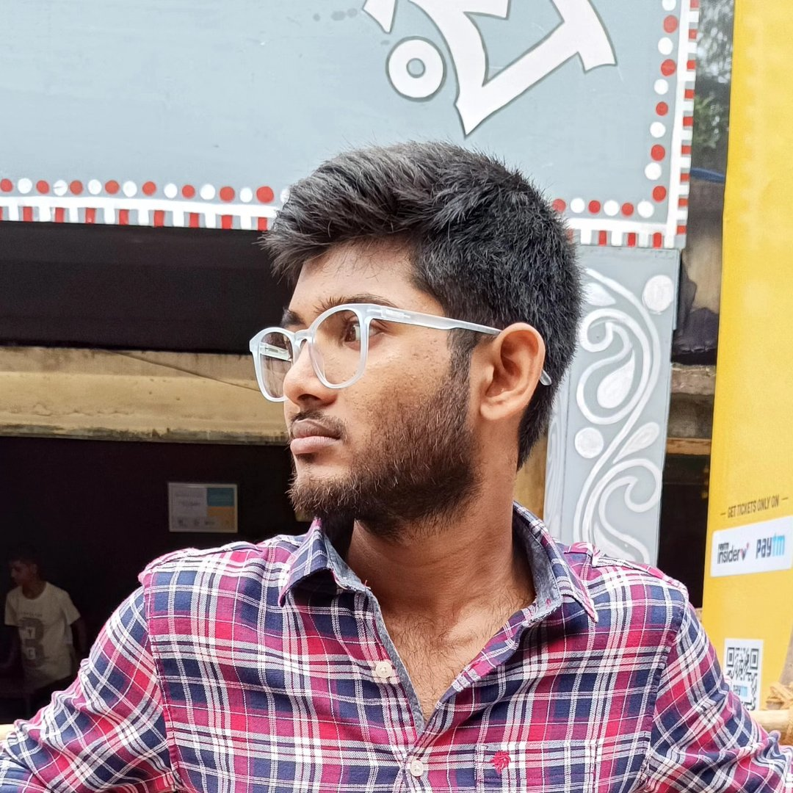

<div align="center">

<!-- Dynamic Header -->


</div>

<!-- Parallax Wave Divider -->


<!-- Profile Section with Modern Card Layout -->
<div align="center">

<table>
<tr>
<td width="40%" align="center">

<!-- Circular Glowing Avatar -->


<br><br>

<!-- Animated Status Badges -->

<br>


</td>
<td width="60%">

<!-- Animated Typing Effect -->


<br>

```javascript
const arghyadip = {
  role: "Fullstack Developer",
  location: "India 🇮🇳",
  interests: ["Web3", "AI/ML", "3D Graphics"],
  tech: {
    frontend: ["React", "Next.js", "Three.js"],
    backend: ["Node.js", "Python", "MongoDB"],
    tools: ["GSAP", "TensorFlow", "Docker"]
  },
  motto: "Code with passion, create with purpose"
};
```

</td>
</tr>
</table>

</div>

<br>

<!-- Animated Wave Separator -->


<br>

<!-- Social Links with Hover Effect -->
<div align="center">

<a href="https://linkedin.com/in/arghyadip-pakhira">
  
</a>
<a href="https://twitter.com/arghya_dip7">
  
</a>
<a href="https://arghyadevs.me">
  
</a>
<a href="mailto:arghyadip.info@gmail.com">
  
</a>
<a href="https://medium.com/@arghyadevs">
  
</a>

</div>

<br><br>

<!-- Tech Stack Showcase -->
<div align="center">


<br><br>

<!-- Tech Categories -->
<table>
<tr>
<td width="50%" valign="top">

### 🎨 Frontend Magic


<br>


</td>
<td width="50%" valign="top">

### ⚙️ Backend Power


<br>


</td>
</tr>
<tr>
<td width="50%" valign="top">

### 🤖 AI & Data Science


<br>


</td>
<td width="50%" valign="top">

### 🛠️ DevOps & Tools


<br>


</td>
</tr>
</table>

</div>

<br>

<!-- Animated Separator -->


<br>

<!-- GitHub Stats Dashboard -->
<div align="center">


<br><br>

<!-- Main Stats Row -->


<br><br>

<!-- Languages & Activity -->


<br><br>

<!-- Trophy Showcase -->


</div>

<br>

<!-- Wave Separator -->


<br>

<!-- Featured Projects Section -->
<div align="center">


<br><br>

<table>
<tr>
<td width="50%">

<h3>🌅 HorizonEase</h3>

[](https://github.com/Arghyadevs/horizonease)

**Modern web platform with stunning animations**

<br>


<br><br>

[](https://horizonease.vercel.app)

</td>
<td width="50%">

<h3>🛡️ SentinelX</h3>

[](https://github.com/Arghyadevs/SentinelX)

**AI-powered security & surveillance system**

<br>


<br><br>

[](https://github.com/Arghyadevs/SentinelX)

</td>
</tr>
</table>

</div>

<br>

<!-- Animated Separator -->


<br>

<!-- Coding Platforms Section -->
<div align="center">


<br><br>

<table>
<tr>
<td width="50%" align="center">

<!-- Platform Badges -->
<a href="https://www.leetcode.com/arghyadevs7">
  
</a>
<a href="https://www.hackerrank.com/arghyadip_info">
  
</a>

<br>

<a href="https://auth.geeksforgeeks.org/user/arghya_devs">
  
</a>
<a href="https://www.codechef.com/users/arghyadevs">
  
</a>

<br><br>

**300+ Problems Solved** • **5⭐ HackerRank** • **Contest Rated**

</td>
<td width="50%">

<!-- LeetCode Card -->


</td>
</tr>
</table>

</div>

<br>

<!-- Snake Animation -->
<div align="center">

<picture>
  <source media="(prefers-color-scheme: dark)" srcset="https://raw.githubusercontent.com/Arghyadevs/Arghyadevs/output/github-snake-dark.svg">
  <source media="(prefers-color-scheme: light)" srcset="https://raw.githubusercontent.com/Arghyadevs/Arghyadevs/output/github-snake.svg">
  
</picture>

</div>

<br>

<!-- Star History & Spotify -->
<table>
<tr>
<td width="50%">

<!-- Star History -->


</td>
<td width="50%">

<!-- Spotify Playing Status -->
<a href="https://spotify-github-profile.vercel.app/api/view?uid=arghyadip&cover_image=true&theme=novatorem&show=false&play=false">
  
</a>

</td>
</tr>
</table>

<br>

<!-- Recent Blog Posts -->
<div align="center">


<br>

<!-- Blog posts will be auto-updated by GitHub Action -->
<!-- @start -->
- 🚀 **HorizonEase: Crafting Digital Experiences with Modern Web Technologies**
- 🚀 **SentinelX: AI-Powered Security & Surveillance System**
- 🚀 **Building Modern Web Applications with React & GSAP**
- 🚀 **Getting Started with Machine Learning Using TensorFlow**
- 🚀 **3D Graphics on the Web with Three.js**
<!-- @end -->

<br>

<a href="https://medium.com/@arghyadevs">
  
</a>

</div>

<br>

<!-- Wave Separator -->


<br>

<!-- Quote Section -->
<div align="center">


</div>

<br>

<!-- Connect & Support Section -->
<div align="center">


<br><br>

<!-- Call to Action Buttons -->
<table>
<tr>
<td align="center" width="33%">


<br><br>

[](https://arghyadevs.vercel.app/assets/Arghyadip_Pakhira_CV.pdf)

</td>
<td align="center" width="33%">


<br><br>

[](https://arghyadevs.me)

</td>
<td align="center" width="33%">


<br><br>

[](mailto:arghyadip.info@gmail.com)

</td>
</tr>
</table>

<br>

<!-- Buy Me A Coffee -->
<a href="https://www.buymeacoffee.com/arghyadevs">
  
</a>

<br><br>

<!-- Visitor Counter -->


</div>

<br>

<!-- Footer -->


<!-- Final Message -->
<div align="center">


<br>

<!-- Animated Footer Icons -->


</div>
