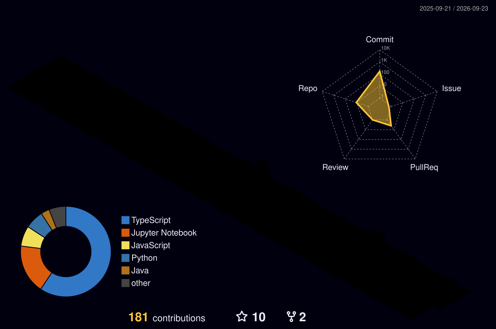

<div align="center">



<br/>

<a href="https://linkedin.com/in/arghyadip-pakhira"></a>
<a href="https://twitter.com/arghya_dip7"></a>
<a href="https://arghyadevs.me"></a>
<a href="mailto:arghyadip.info@gmail.com"></a>

<br/><br/>


</div>

<br/>

<p align="center">Full-stack developer and AI engineer based in India — working across distributed backend systems, applied AI features, and interfaces built to actually be used.</p>


## 🛰️ Mission Control

```ts
const dev = {
  name: "Arghyadip Pakhira",
  handle: "@Arghyadevs",
  role: "Full-Stack Developer · AI Systems Engineer",
  base: "India",
  focus: [
    "Scalable distributed systems",
    "AI integrated into real products",
    "Interfaces worth using",
    "Infrastructure that ships",
  ],
  stack: ["TypeScript", "React", "Next.js", "Node.js", "Python", "Docker"],
  motto: "Build clean. Ship fast. Reach orbit.",
};
```


## ⚙️ Tech Stack

<p align="center">
  
</p>
<p align="center">
  
</p>


## 📡 GitHub Telemetry

<p align="center">
  
  
</p>

<p align="center">
  
</p>


## 🌌 Contribution Log

<p align="center">
  
</p>

<p align="center">
  <picture>
    <source media="(prefers-color-scheme: dark)" srcset="https://raw.githubusercontent.com/Arghyadevs/Arghyadevs/output/github-snake-dark.svg">
    <source media="(prefers-color-scheme: light)" srcset="https://raw.githubusercontent.com/Arghyadevs/Arghyadevs/output/github-snake.svg">
    
  </picture>
</p>

<p align="center">
  
</p>

<p align="center">
  
</p>


## 🚀 Featured Missions

<p align="center">
  <a href="https://github.com/Arghyadevs/CampusSite">
    
  </a>
  <a href="https://github.com/Arghyadevs/SentinelX">
    
  </a>
</p>
<p align="center">
  <a href="https://github.com/Arghyadevs/CIRCLO_SOCIAL">
    
  </a>
  <a href="https://github.com/Arghyadevs/Indian-Army">
    
  </a>
</p>


## 📰 Transmissions

<!-- BLOG-POST-LIST:START -->- 🚀 **How DRM Secures Online Education: Behind the Scenes of Video Streaming on PW Live &amp; PenPencil**- 🚀 **How Smart Traffic Systems Are Revolutionizing Urban Mobility**<!-- BLOG-POST-LIST:END -->


## ⏱️ Dev Metrics — WakaTime

<!--START_SECTION:waka-->


**🐱 My GitHub Data** 

> 📦 529.3 kB Used in GitHub's Storage 
 > 
> 🏆 138 Contributions in the Year 2026
 > 
> 💼 Opted to Hire
 > 
> 📜 28 Public Repositories 
 > 
> 🔑 24 Private Repositories 
 > 
**I'm a Night 🦉** 

```text
🌞 Morning                224 commits         ████████░░░░░░░░░░░░░░░░░   31.68 % 
🌆 Daytime                124 commits         ████░░░░░░░░░░░░░░░░░░░░░   17.54 % 
🌃 Evening                271 commits         ██████████░░░░░░░░░░░░░░░   38.33 % 
🌙 Night                  88 commits          ███░░░░░░░░░░░░░░░░░░░░░░   12.45 % 
```
📅 **I'm Most Productive on Tuesday** 

```text
Monday                   73 commits          ███░░░░░░░░░░░░░░░░░░░░░░   10.33 % 
Tuesday                  208 commits         ███████░░░░░░░░░░░░░░░░░░   29.42 % 
Wednesday                56 commits          ██░░░░░░░░░░░░░░░░░░░░░░░   07.92 % 
Thursday                 86 commits          ███░░░░░░░░░░░░░░░░░░░░░░   12.16 % 
Friday                   71 commits          ███░░░░░░░░░░░░░░░░░░░░░░   10.04 % 
Saturday                 122 commits         ████░░░░░░░░░░░░░░░░░░░░░   17.26 % 
Sunday                   91 commits          ███░░░░░░░░░░░░░░░░░░░░░░   12.87 % 
```


📊 **This Week I Spent My Time On** 

```text
🕑︎ Time Zone: Asia/Kolkata

💬 Programming Languages: 
No Activity Tracked This Week

🔥 Editors: 
No Activity Tracked This Week

🐱‍💻 Projects: 
No Activity Tracked This Week

💻 Operating System: 
No Activity Tracked This Week
```

**I Mostly Code in TypeScript** 

```text
TypeScript               16 repos            █████████░░░░░░░░░░░░░░░░   34.04 % 
HTML                     16 repos            █████████░░░░░░░░░░░░░░░░   34.04 % 
JavaScript               5 repos             ███░░░░░░░░░░░░░░░░░░░░░░   10.64 % 
PLSQL                    1 repo              █░░░░░░░░░░░░░░░░░░░░░░░░   02.13 % 
Jupyter Notebook         1 repo              █░░░░░░░░░░░░░░░░░░░░░░░░   02.13 % 
```


**Timeline**


 Last Updated on 17/07/2026 15:28:32 UTC
<!--END_SECTION:waka-->


## 🌐 Connect

<div align="center">

<a href="https://arghyadevs.me"></a>
<a href="mailto:arghyadip.info@gmail.com"></a>
<a href="https://linkedin.com/in/arghyadip-pakhira"></a>

</div>
