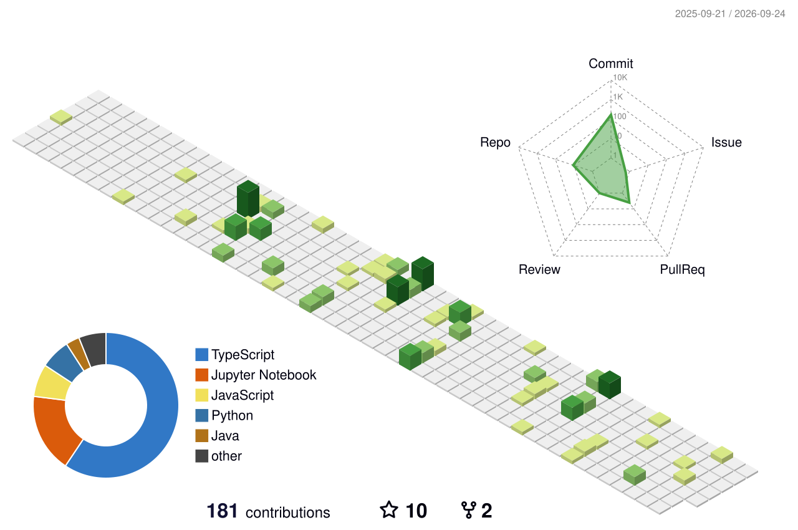

<div align="center">
  

  

  <p>
    
    
    
  </p>

  <p>
    <a href="https://linkedin.com/in/arghyadip-pakhira"></a>
    <a href="https://twitter.com/arghya_dip7"></a>
    <a href="https://arghyadevs.me"></a>
    <a href="mailto:arghyadip.info@gmail.com"></a>
    <a href="https://medium.com/@arghyadevs"></a>
  </p>
</div>

---

## About Me

```ts
const arghyadip = {
  role: "Full-Stack Developer",
  location: "India",
  focus: ["Scalable Web Apps", "AI Integrations", "Interactive UI"],
  stack: {
    frontend: ["React", "Next.js", "TypeScript", "Tailwind"],
    backend: ["Node.js", "Python", "Express", "FastAPI"],
    data_ai: ["MongoDB", "PostgreSQL", "TensorFlow", "PyTorch"],
    devops: ["Docker", "AWS", "GitHub Actions", "Vercel"]
  },
  motto: "Build clean. Ship fast. Keep improving."
};
```

- I design and build polished products with strong engineering foundations.
- I care about performance, developer experience, and production reliability.
- I enjoy combining visual creativity with robust backend architecture.

## Tech Stack

<p align="center">
  
</p>

## Engineering Snapshot

<p align="center">
  
  
</p>

<p align="center">
  
  
</p>

<p align="center">
  
</p>

## Animated Contribution Views

<p align="center">
  
</p>

<p align="center">
  <picture>
    <source media="(prefers-color-scheme: dark)" srcset="https://raw.githubusercontent.com/Arghyadevs/Arghyadevs/output/github-snake-dark.svg">
    <source media="(prefers-color-scheme: light)" srcset="https://raw.githubusercontent.com/Arghyadevs/Arghyadevs/output/github-snake.svg">
    
  </picture>
</p>

## Featured Projects

<p align="center">
  <a href="https://github.com/Arghyadevs/horizonease">
    
  </a>
  <a href="https://github.com/Arghyadevs/SentinelX">
    
  </a>
</p>

<p align="center">
  <a href="https://github.com/Arghyadevs/Arghyadevs">
    
  </a>
</p>

## Competitive Coding

<p align="center">
  <a href="https://www.leetcode.com/arghyadevs7"></a>
  <a href="https://www.hackerrank.com/arghyadip_info"></a>
  <a href="https://auth.geeksforgeeks.org/user/arghya_devs"></a>
  <a href="https://www.codechef.com/users/arghyadevs"></a>
</p>

<p align="center">
  
</p>

## Latest Blog Posts

<!-- BLOG-POST-LIST:START -->- 🚀 **How DRM Secures Online Education: Behind the Scenes of Video Streaming on PW Live &amp; PenPencil**- 🚀 **How Smart Traffic Systems Are Revolutionizing Urban Mobility**<!-- BLOG-POST-LIST:END -->

## WakaTime

<!--START_SECTION:waka-->


**🐱 My GitHub Data** 

> 📦 411.2 kB Used in GitHub's Storage 
 > 
> 🏆 21 Contributions in the Year 2026
 > 
> 💼 Opted to Hire
 > 
> 📜 22 Public Repositories 
 > 
> 🔑 25 Private Repositories 
 > 
**I'm an Early 🐤** 

```text
🌞 Morning                212 commits         █████████░░░░░░░░░░░░░░░░   36.30 % 
🌆 Daytime                103 commits         ████░░░░░░░░░░░░░░░░░░░░░   17.64 % 
🌃 Evening                205 commits         █████████░░░░░░░░░░░░░░░░   35.10 % 
🌙 Night                  64 commits          ███░░░░░░░░░░░░░░░░░░░░░░   10.96 % 
```
📅 **I'm Most Productive on Tuesday** 

```text
Monday                   57 commits          ██░░░░░░░░░░░░░░░░░░░░░░░   09.76 % 
Tuesday                  183 commits         ████████░░░░░░░░░░░░░░░░░   31.34 % 
Wednesday                44 commits          ██░░░░░░░░░░░░░░░░░░░░░░░   07.53 % 
Thursday                 81 commits          ███░░░░░░░░░░░░░░░░░░░░░░   13.87 % 
Friday                   55 commits          ██░░░░░░░░░░░░░░░░░░░░░░░   09.42 % 
Saturday                 109 commits         █████░░░░░░░░░░░░░░░░░░░░   18.66 % 
Sunday                   55 commits          ██░░░░░░░░░░░░░░░░░░░░░░░   09.42 % 
```


📊 **This Week I Spent My Time On** 

```text
🕑︎ Time Zone: Asia/Kolkata

💬 Programming Languages: 
SQL                      41 mins             ███████████████████████░░   91.84 % 
Other                    3 mins              ██░░░░░░░░░░░░░░░░░░░░░░░   08.16 % 

🔥 Editors: 
VS Code                  45 mins             █████████████████████████   100.00 % 

🐱‍💻 Projects: 
DBMS_LAB                 45 mins             █████████████████████████   100.00 % 

💻 Operating System: 
Mac                      45 mins             █████████████████████████   100.00 % 
```

**I Mostly Code in HTML** 

```text
HTML                     16 repos            ██████████░░░░░░░░░░░░░░░   40.00 % 
TypeScript               11 repos            ███████░░░░░░░░░░░░░░░░░░   27.50 % 
JavaScript               6 repos             ████░░░░░░░░░░░░░░░░░░░░░   15.00 % 
Java                     1 repo              █░░░░░░░░░░░░░░░░░░░░░░░░   02.50 % 
Shell                    1 repo              █░░░░░░░░░░░░░░░░░░░░░░░░   02.50 % 
```


**Timeline**


 Last Updated on 01/03/2026 06:10:43 UTC
<!--END_SECTION:waka-->

## Collaboration

<p align="center">
  I am open to full-time roles, freelance projects, and technical collaborations.
</p>

<p align="center">
  <a href="https://arghyadevs.me"></a>
  <a href="mailto:arghyadip.info@gmail.com"></a>
  <a href="https://www.buymeacoffee.com/arghyadevs"></a>
</p>

<div align="center">
  
</div>
